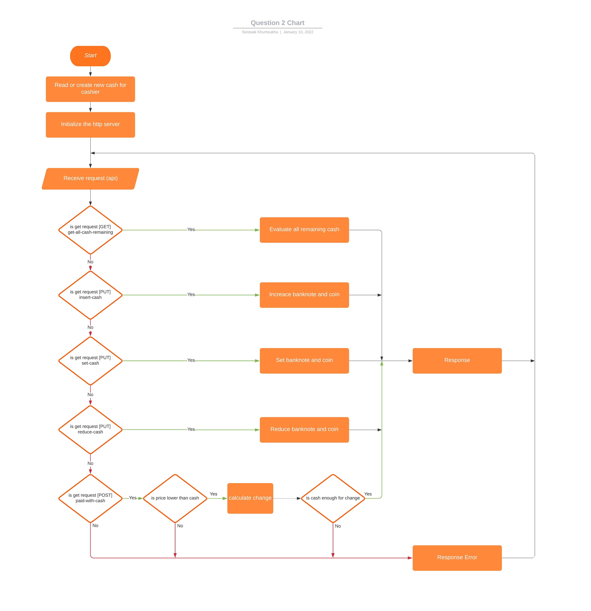

# Assignment 

## Question 2
Design API to support auto cashier system with the following limitations

• The maximum amount of banknotes or coins stored in the cashier desk has
the limit as in the table

| Bank Note/Coin Value | Amount |
|----------------------|--------|
| 1000                 | 10     |
| 500                  | 20     |
| 100                  | 15     |
| 50                   | 20     |
| 20                   | 30     |
| 10                   | 20     |
| 5                    | 20     |
| 1                    | 20     |
| 0.25                 | 50     |

• Design feature to calculate the change money when the customer pays
with the cash value larger than the product price
    
• There must be the amount banknotes or coins come out to match the
change money value that the customer will receive
    
• Design feature and function that the system should have
    
• Design the system flow

***
## RESTful API

### API documentation

#### GET */get-all-cash-remaining*
Description: 
Get all remaining banknotes and coins

Query: -

Response:

```json
{
    "error": null,
    "result": {
        "cashList": [
            {
                "value": 1000,
                "amount": 10
            },
            {
                "value": 500,
                "amount": 20
            },
            {
                "value": 100,
                "amount": 15
            },
            {
                "value": 50,
                "amount": 20
            },
            {
                "value": 20,
                "amount": 30
            },
            {
                "value": 10,
                "amount": 20
            },
            {
                "value": 5,
                "amount": 20
            },
            {
                "value": 1,
                "amount": 20
            },
            {
                "value": 0.25,
                "amount": 50
            }
        ],
        "total": 23432.5
    }
}
```
___

#### PUT */insert-cash*
Description:
Add specific banknotes and coins to cashier 

Body: 
- cashList ***Array of Object*** - An array of banknotes and coins
  - value ***float32*** - banknote or coin type
  - amount ***uint8*** - amount of banknote or coin

```json
{
    "cashList": [
        {
            "value": 1000,
            "amount": 1
        },
        {
            "value": 500,
            "amount": 1
        },
        {
            "value": 100,
            "amount": 1
        },
        {
            "value": 50,
            "amount": 1
        },
        {
            "value": 20,
            "amount": 1
        },
        {
            "value": 10,
            "amount": 1
        },
        {
            "value": 5,
            "amount": 1
        },
        {
            "value": 1,
            "amount": 1
        },
        {
            "value": 0.25,
            "amount": 1
        }
    ]
}
```

Response:

```json
{
    "error": null,
    "result": {
        "fail": 0,
        "success": 9,
        "failList": null
    }
}
```
___

#### PUT */set-cash*
Description:
Set banknotes and coins to specific amount

Body:
- cashList ***Array of Object*** - An array of banknotes and coins
    - value ***float32*** - banknote or coin type
    - amount ***uint8*** - amount of banknote or coin

```json
{
    "cashList": [
        {
            "value": 1000,
            "amount": 1
        },
        {
            "value": 500,
            "amount": 1
        },
        {
            "value": 100,
            "amount": 1
        },
        {
            "value": 50,
            "amount": 1
        },
        {
            "value": 20,
            "amount": 1
        },
        {
            "value": 10,
            "amount": 1
        },
        {
            "value": 5,
            "amount": 1
        },
        {
            "value": 1,
            "amount": 1
        },
        {
            "value": 0.25,
            "amount": 1
        }
    ]
}
```

Response:

```json
{
    "error": null,
    "result": {
        "fail": 0,
        "success": 9,
        "failList": null
    }
}
```
___

#### PUT */reduce-cash*
Description:
Reduce specific banknotes and coins to cashier

Body:
- cashList ***Array of Object*** - An array of banknotes and coins
    - value ***float32*** - banknote or coin type
    - amount ***uint8*** - amount of banknote or coin

```json
{
    "cashList": [
        {
            "value": 1000,
            "amount": 1
        },
        {
            "value": 500,
            "amount": 1
        },
        {
            "value": 100,
            "amount": 1
        },
        {
            "value": 50,
            "amount": 1
        },
        {
            "value": 20,
            "amount": 1
        },
        {
            "value": 10,
            "amount": 1
        },
        {
            "value": 5,
            "amount": 1
        },
        {
            "value": 1,
            "amount": 1
        },
        {
            "value": 0.25,
            "amount": 1
        }
    ]
}
```

Response:

```json
{
    "error": null,
    "result": {
        "fail": 0,
        "success": 9,
        "failList": null
    }
}
```
___

#### POST */pay-by-cash*
Description:
Calculate the change and return amount of banknotes or coin for change **Automatic reduce the banknotes and coins if it enough for change**

Body: 
- paid ***Array of Object*** - An array of banknotes and coins
    - value ***float32*** - Banknote or coin type
    - amount ***uint8*** - Amount of banknote or coin
- price ***float32*** - Price of item

```json
{
  "paid": [
    {
      "value": 1000,
      "amount": 4
    }
  ],
  "price": 3200
}
```

Response:

```json
{
    "error": null,
    "result": {
        "changeList": [
            {
                "value": 1000,
                "amount": 0
            },
            {
                "value": 500,
                "amount": 1
            },
            {
                "value": 100,
                "amount": 3
            },
            {
                "value": 50,
                "amount": 0
            },
            {
                "value": 20,
                "amount": 0
            },
            {
                "value": 10,
                "amount": 0
            },
            {
                "value": 5,
                "amount": 0
            },
            {
                "value": 1,
                "amount": 0
            },
            {
                "value": 0.25,
                "amount": 0
            }
        ],
        "totalChange": 800
    }
}
```

***

## System Flow

[//]: # (![]&#40;https://github.com/paekub39/assignment/question_2/SystemFlow.png?raw=true&#41;)
